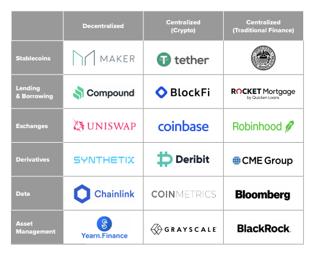

# Overview and Origin

**Name of company**: Compound Labs  

**When was the company incorporated?** The company was incorporated in august 2017 [^1]

**Who are the founders of the company?**Geoffrey Hayes, Robert Leshner 

**How did the idea for the company (or project) come about?**
Robert Leshner  and Geoffrey Hayes leveraged their experience from building a software company like safeshepherd [^2]   (company specialized in removing users' personal information on the internet) ,    leshner's experience as a product lead (Postmates) and financial industry's experience during the 2008 crisis (the great recession).  Fresh from this experience with the lack of transparency in traditional  markets, building products on a blockchain appeared attractive because [^3]:  
* It is open to everyone in the world: the development process is facilitated by the technology and the team of engineers can collaborate from anywhere in the world. This is contrary to traditional finance, which is limited by national financial systems that require local presence . 
* The fact that the products are composable: you can build applications that interact within the ecosystem without permissions compared to the years of business development of partnerships in traditional finance 

* The ease with which projects can build on top of decentralized dapps   

There are been three iterations for the Compound product which aimed at create interest rates for crypto assets. First introduced as a clunky version of the final product to a small number of people, the main net launched (meaning the blockchain protocol is developed and deployed to the Ethereum blockchain) in august 2018  

**How is the company funded?** The company is funded by venture capital firms 

**How much funding have they received?** The total funding amount to $33.2 million from 12 investors [^4]

---
# Business Activities 

**What specific financial problem is the company or project trying to solve?** 
The current borrowing and lending system requires the intermediation of banks to serve as credible lenders who use a complex system of credit rating and eligibility requirement to measure the ability of borrowers to repay the loan. Additionally, the customers are subject to lower rates for interest income as a result of banking fees and the current post-covid 19 monetary policy. 

 

**Who is the company's intended customer?** 
The primary focus is the current retail banking customer through the compound finance application. Additionally, Compound recently expanded its ambition to provide institutions the ability to earn high yield interest through the Compound Treasury application. The latter provides an ability to earn interest income while abstracting away the complexities of connecting wallets and managing keys. 

The current borrowing and lending system requires the intermediation of banks to serve as credible lenders who use a complex system of credit rating and eligibility requirement to measure the ability of borrowers to repay the loan. Additionally, the customers are subject to lower rates for interest income as a result of banking fees and the current post-covid 19 monetary policy. 

**Is there any information about the market size of this set of customers?**
[^5]

 

**What solution does this company offer that their competitors do not or cannot offer? (What is the unfair advantage they utilize?)** 

[^6] 
The competitor for this company are companies in the centralized and traditional finance space. The advantages compared to the competition are: 

No nation, corporation or third party can control who has the right to borrow or lend on the Compound protocol (Censorship-resistant and permissionless) 

* Uninterrupted, fast transactions 24/7 

* Transactions are cheaper than traditional finance 

* Regulatory scrutiny is less than centralized and traditional counterparts 

* Higher yields on deposits compared to competition 

 
 
**Which technologies are they currently using, and how are they implementing them? (This may take a little bit of sleuthing–– you may want to search the company’s engineering blog or use sites like Stackshare to find this information.)**
[^7]
Source:  https://research.stlouisfed.org/publications/review/2021/02/05/decentralized-finance-on-blockchain-and-smart-contract-based-financial-markets  
The domain of financial industry here is decentralized finance and the technological infrastructure here is the multi-layer architecture: 

* The protocol layer provides standard use cases for borrowing and lending and sits on top of the settlement layer which is the Ethereum blockchain.  

* The settlement layer is the foundation where the trustless execution and settlement happens.  

* The asset layer consist of the ERC-20 tokens ( e.g. COMP the ERC-20 compound protocol token) 

 

Compound protocol  (protocol layer) operates as a liquidity pool on top of the Ethereum blockchain (settlement layer). Suppliers provide assets (ERC-20 tokens as assets)  earning interest to the liquidity pool while borrowers take a loan from pool paying interest on the debt incurred. The Compound protocols uses algorithms to determine interest (Annual percentage yield) according to the supply and demand of the asset . Efficiency is thus gained by allowing borrowers and lenders to interact directly with the protocol without needing negotiation for the loan terms. 

---
# Landscape:

**What domain of the financial industry is the company in?**

Decentralized finance Lending and Borrowing with three main players: 

* Compound protocol where you can borrow and lend cryptocurrencies frictionessly 

* Maker borrowing protocol that enables over-collaterized loans to mint dai 

* AAVE which offers more assets to use and lending primitives liek rate switching, collateral swap, flash loans  

**What have been the major trends and innovations of this domain over the last 5-10 years?**
* High Fees for transactions on the ethereum blockchain 

* After ballooning deposits in Q1, lower deposits due to market turbulence in Q2 

* Interoperability (with examples like compound gateway, thorchain, cosmos, polkadot, etc...) is the main innovation aimed at lowering fees for users 

---

# Results 

**What has been the business impact of this company so far?**

according to dune analytics, the explosion of the decentralized lending protocols https://messari.io/article/q2-21-defi-review?referrer=grid-view 
 

 
**What are some of the core metrics that companies in this domain use to measure success?**

* Share of lending market on ethereum blockchain 

* Amount deposited and borrow over time 

**How is your company performing, based on these metrics?**
According to dune analytics https://dune.xyz/queries/26890 Compound labs stand second to AAve in share of lending market. 

**How is your company performing relative to competitors in the same domain?**
Compound was the leader in the domain but has seen its dominance threaten by the launch of AAVE's polygon branch (which lowers users fees). Compound is still the domain leader.

---
# Recommendations

**If you were to advise the company, what products or services would you suggest they offer? (This could be something that a competitor offers, or use your imagination!)**

A key driver for growth is going to be market penetration in third world countries. The best way to reach these population, is to explore mobile transactions. Binance P2P (https://www.binance.com/en/blog/421499824684901451/how-to-top-up-your-mobile-phone-with-bitcoin-on-binance-p2p) and Telcoin (https://www.telco.in/) are excellent endeavors which explore this solution. 

**Why do you think that offering this product or service would benefit the company?**
 

Third world countries are known to be afflicted with huge cost of capital due to credit risk ( banks are rarely willing to take on risk there and require excessive collateral). The accumulation of crypto assets and the permissionless and censorship resistance, allows for the access to cheap capital if the users accumulate digital assets as form of capital. This is market of close to 2 to 3 billion people. This can also be a great solution for workers who reside outside of their home country(275 million according to  a report of the united nations https://www.un.org/en/development/desa/population/migration/publications/migrationreport/docs/InternationalMigration2019_Report.pdf). They would be able to borrow against digital asset and invest in their home country 

 

 
**What technologies would this additional product or service utilize?**
 

Compound labs can design and develop mobile-based borrowing and lending protocols built on top of cross chain infrastructure ( by using polygon, compound gateway for instance) to lower fees for underserved population 

 

 
**Why are these technologies appropriate for your solution?**
 

The technology is appropriate for this solution because it removes the exclusive reliance on expensive Ethereum layer 1 settlement layer and provides access to Compound financial products for a large unbanked population 

 

Sources: 
[^1][Compound Labs incorporation](https://www.crunchbase.com/organization/compound-labs)

[^2][Safeshepherd](https://www.crunchbase.com/organization/safe-shepherd#section-overview)

[^3][Coinbase presentation](https://www.youtube.com/watch?v=R7pFVzOvUiw&ab_channel=Coinbase)

[^4][funding source](https://www.crunchbase.com/organization/compound-labs/company_financials)

[^5][deposits and loans on compound protocol](https://compound.finance/markets)

[^6][Source: A primer on Decentralized Finance (DeFi) - July 2021 report Grayscale premier]

[^7][Multi layer infrastructure](https://research.stlouisfed.org/publications/review/2021/02/05/decentralized-finance-on-blockchain-and-smart-contract-based-financial-markets)

